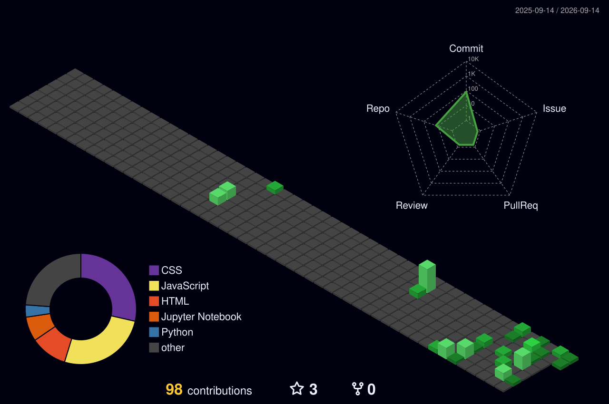

<div align="center">

# `~/deekshitha`

### Robotics & AI Student • Software Developer


</div>

---

### `~/ about`

```text
Hi, I'm Deekshitha 👋

Robotics & Artificial Intelligence undergraduate at
Bangalore Institute of Technology.

Currently working as a Software Development Intern at
Diginow Solutions, building responsive web applications
and collaborating with remote Agile teams.

Interested in full-stack development, AI-integrated
applications and IoT systems.
```

---

### `~/ toolbox`

<p align="center">


</p>

```text
Languages       → Java • Python • JavaScript • TypeScript • SQL
Frontend        → HTML5 • CSS3 • React.js • Tailwind CSS
Backend / Data  → PostgreSQL • Supabase • REST APIs
AI / Tools      → Groq API • Streamlit • Git • GitHub
IoT             → GPS / IoT Integration
```

---

### `~/ experience`

**Software Development Intern — Diginow Solutions**

`React.js` `JavaScript` `Tailwind CSS` `Git` `GitHub`

```text
→ Developing responsive, user-centric web applications
→ Contributing to client website redesign and development
→ Building reusable and maintainable UI components
→ Debugging, testing and optimizing web applications
→ Collaborating with remote teams in an Agile environment
```

---

### `~/ projects`

#### 🏠 Rentora

`Frontend Development` `Supabase` `PostgreSQL` `UI Design`

A web-based rental platform enabling users to browse, list and manage rental products through a responsive interface.

#### 🤖 Resume Analyzer AI

`Python` `Streamlit` `Groq API` `Llama 3.3 70B` `pdfplumber` `Plotly`

AI-powered resume analyzer generating role-specific ATS scores, keyword-gap analysis and structured feedback.

#### 🧠 DocuMind — RAG Chatbot

`LangChain` `ChromaDB` `Groq API` `Streamlit`

RAG chatbot that answers questions from user-uploaded PDFs with cited sources using vector retrieval.

#### ❤️ Cardiac Abnormality Detection Wearable

`IoT` `ECG` `Motion Sensors` `System Design`

Ongoing IoT wearable system designed for real-time cardiac monitoring and predictive alerts.

---

### `~/ certifications`

```text
01  Artificial Intelligence & Machine Learning
    Infosys Springboard • 2025

02  Machine Learning A–Z using Python
    2025

03  Web Development
    Elevance Skills • 2026
```

---

### `~/ leadership`

**Creative Committee Head — Robotics Club**

Planning and executing branding, promotional campaigns and creative initiatives for technical events while collaborating with cross-functional student teams.

---

### `~/ github_activity`

<div align="center">


</div>

---

### `~/ contribution_radar`

<div align="center">



</div>

---

### `~/ currently`

```text
┌─ exploring
│  ├── Full-Stack Development
│  ├── AI-integrated Applications
│  └── RAG / LLM Applications
│
├─ building
│  ├── AI Applications
│  └── IoT Systems
│
└─ goal
   └── Grow as a Software Developer
```

---

### `~/ connect`

<div align="center">

<a href="https://github.com/deekshithap-07">

</a>

<a href="https://www.linkedin.com/in/deekshitha-p-054246298/">

</a>

</div>

<br>

<div align="center">

`Build • Learn • Improve • Repeat`

</div>
