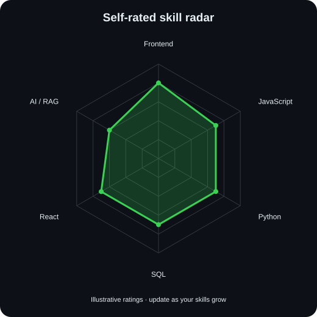
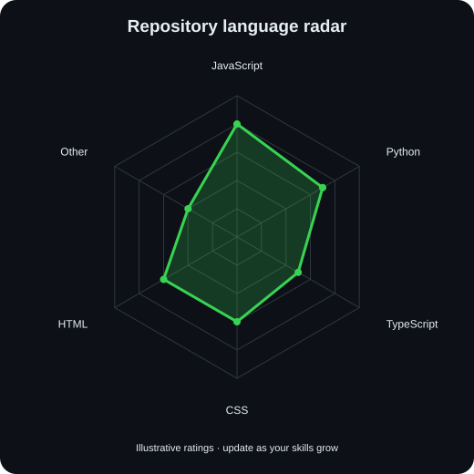
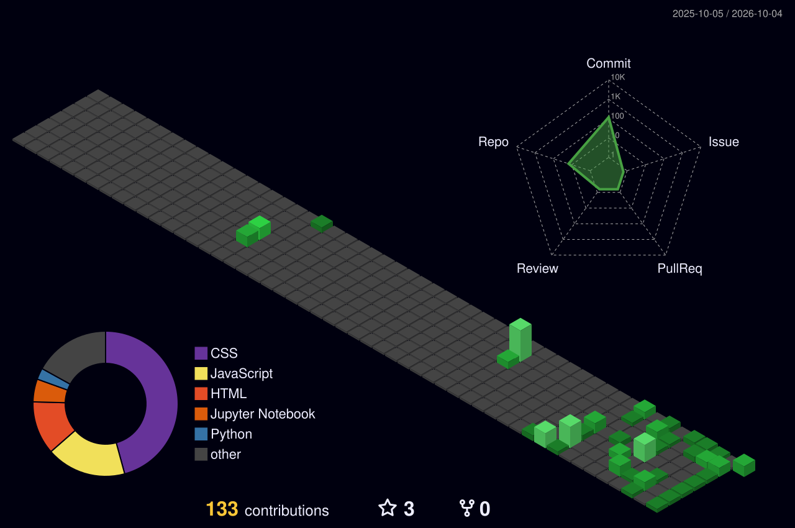

<div align="center">

<!-- ==================== PORTRAIT ==================== -->


<br>


<br>

<a href="https://github.com/deekshithap-07">

</a>

<a href="mailto:deekshashivu@gmail.com">

</a>


</div>

---

## `~/` whoami

```console
$ cat about.txt
```

Hi, I'm **Deekshitha P**, a Robotics & Artificial Intelligence undergraduate at **Bangalore Institute of Technology**, currently working as a **Software Development Intern at Diginow Solutions**.

I build responsive web applications and I'm exploring the intersection of **full-stack development, AI-integrated applications and IoT systems**.

* 🎓 B.E. Robotics & Artificial Intelligence · 2023–2027
* 💼 Software Development Intern · Diginow Solutions
* 🔨 Currently building **AI, RAG and IoT projects**
* 📚 Learning **full-stack development and AI-integrated tools**

---

## `~/ toolbox`

<div align="center">


</div>

```text
LANGUAGES
Java · Python · JavaScript · TypeScript · SQL

FRONTEND
HTML5 · CSS3 · React.js · Tailwind CSS

BACKEND / DATABASE
PostgreSQL · Supabase · REST APIs

AI / DEVELOPMENT TOOLS
Groq API · Streamlit · Git · GitHub

IOT
GPS / IoT Integration
```

---


### `~/ skill radar`

<table>
  <tr>
    <td width="50%" align="center">
      <h3>Self-rated</h3>
      
    </td>
    <td width="50%" align="center">
      <h3>From my repositories</h3>
      
    </td>
  </tr>
</table>


   

    


## `~/ contribution graph`

<div align="center">



</div>

<br>

<div align="center">


</div>

---

<div align="center">
  
</div>


## `~/ achievements`

```text
01  Artificial Intelligence & Machine Learning
    Infosys Springboard · 2025

02  Machine Learning A–Z using Python
    2025

03  Web Development
    Elevance Skills · 2026

04  Creative Committee Head
    Robotics Club · Bangalore Institute of Technology
```

---


### `~/ featured projects`

<div align="center">

<a href="https://github.com/deekshithap-07/RENTORA_REPOSITORY">🏠 Rentora</a>
&nbsp; • &nbsp;
<a href="https://github.com/deekshithap-07/RESUME_ANALYZER_REPOSITORY">🤖 Resume Analyzer AI</a>

<a href="https://github.com/deekshithap-07/DOCUMIND_REPOSITORY">🧠 DocuMind – RAG Chatbot</a>
&nbsp; • &nbsp;
<a href="https://github.com/deekshithap-07/CARDIAC_WEARABLE_REPOSITORY">❤️ Cardiac Abnormality Detection Wearable</a>

</div>


## `~/ currently`

```text
┌──────────────────────────────────────────────────┐
│                                                  │
│  BUILDING                                        │
│  ├── AI-powered applications                    │
│  ├── RAG / LLM applications                     │
│  └── IoT systems                                │
│                                                  │
│  LEARNING                                        │
│  ├── Full-Stack Development                     │
│  ├── AI-integrated tools                        │
│  └── Modern software engineering                │
│                                                  │
│  INTERESTS                                       │
│  ├── Artificial Intelligence                    │
│  ├── Web Development                            │
│  └── Robotics & IoT                             │
│                                                  │
└──────────────────────────────────────────────────┘
```

---

## `~/ experience`

### Software Development Intern · Diginow Solutions

`React.js` `JavaScript` `Tailwind CSS` `Git` `GitHub`

* Developing responsive, user-centric web applications.
* Contributing to the redesign and development of a client public website.
* Building reusable and maintainable UI components.
* Debugging, testing and optimizing web applications.
* Collaborating with remote development teams using Git and GitHub.
* Participating in feature development, code reviews and Agile iteration.

---

## `~/ project stack`

| Project                        | Technologies                                                        |
| ------------------------------ | ------------------------------------------------------------------- |
| **Rentora**                    | Supabase · PostgreSQL · Frontend Development · UI Design            |
| **Resume Analyzer AI**         | Python · Streamlit · Groq API · Llama 3.3 70B · pdfplumber · Plotly |
| **DocuMind – RAG Chatbot**     | LangChain · ChromaDB · Groq API · Streamlit                         |
| **Cardiac Detection Wearable** | IoT · ECG · Motion Sensors · System Design                          |

---

<div align="center">

### `build • learn • improve`

<br>


</div>
